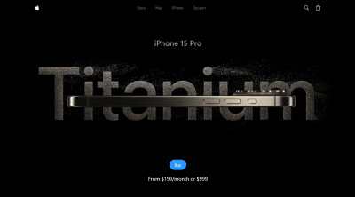
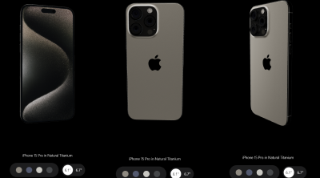
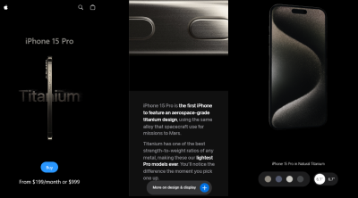

# 📱 Iphone 15 pro Clone


[](https://opensource.org/licenses/MIT)

## Screenshots

<div align="center">
  
  
  
</div>

<div align='center'>
  <p>--------------------------------------------------</p>
</div>

<div align="center">
  <p><strong>Preview: </strong> <a href="https://iphone-15-pro-clone.netlify.app">See Preview</a></p>
</div>

## Technologies Used

<div align="center">
  
  
  
  
</div>


## Description

🚀 Iphone 15 Pro Clone is a web application developed to showcase my skills in web development using specific technologies, with the Iphone 15 pro website as reference.

## Key Features

### Interactive 3D Visualization

🔍 Utilizing Three.js, users can explore dynamic 3D scenes with smooth animations and responsive controls.

### Engaging User Interactions

🎉 GSAP animations enhance user engagement by providing seamless transitions and delightful effects throughout the application.

### Responsive Design

📱 Tailwind CSS ensures that the application is fully responsive, delivering a consistent experience across various devices and screen sizes.

## Installation and Execution

1. Clone the repository:

   ```bash
   git clone https://github.com/mani254/Iphone-15-pro-clone.git

2. Install Dependencies:

   npm install
   
3. Run The Project

   npm run dev
